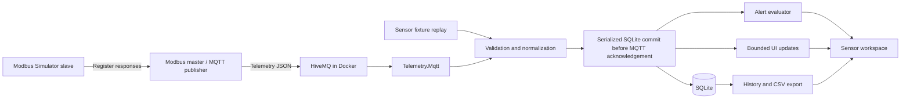

# MQTT Data Logger and Dashboard Implementation Plan

## Status and Purpose

- Created: 2026-09-11. Status: **working MQTT/Modbus baseline implemented; final simulator and extended acceptance checks remain**.
- Repository baseline: `5969adb7e14233a6fcd9aa5bab5b3a0bd4cfe62c`.
- Goal: extend the existing Windows Forms Binance monitor with MQTT sensor monitoring, durable logging, charts, threshold alerts, history, and CSV export.
- Selected source stack: **HiveMQ CE 2026.5 in Docker** at `127.0.0.1:1883` with persistent storage, plus a separate read-only Modbus-to-MQTT bridge. HiveMQ has been started and tested. The third-party **Modbus Simulator** distribution/version and actual register setup remain unconfirmed; end-to-end testing used a temporary protocol fixture instead.
- This document is the delivery tracker. The implementation record below supersedes earlier proposed details where noted; unchecked items remain acceptance or follow-up work. See `docs/mqtt-emulator.md` for runnable instructions.

### Implementation Record — 2026-09-11

- Added `Telemetry.Core`, `Telemetry.Mqtt`, `Telemetry.Storage`, and `ModbusMqttBridge`, plus sensor Forms views and telemetry/UI console checks.
- MQTTnet `5.2.0.1603` and Microsoft.Data.Sqlite `10.0.12` are pinned. The sensor chart uses native WinForms drawing, matching the existing market chart; no LiveCharts dependency or Windows target change was needed.
- **MQTT sensors** opens a sensor window after stopping Binance. It includes profile validation, Windows-protected saved passwords, sensor replay, bounded charts/grid, history and CSV, versioned rules, alert acknowledgement, backup, and manual retention.
- `MqttSource.RunAsync` accepts an awaited persistence callback instead of an async-stream source interface. A reading, alert transition, and rule checkpoint commit in one SQLite transaction before MQTT acknowledgement. There is one active callback writer and no separate application persistence queue. Bulk transaction batching remains an optimization, not an implemented claim.
- SQLite schema version 2 uses `PRAGMA user_version`, denormalized source metadata on `Readings`, `Rules`, immutable `RuleVersions`, and `AlertEvents`. This replaces the proposed separate Sources/SchemaVersion tables and replay checkpoint with an atomic transaction boundary. Retention is manual; no automatic scheduler was added.
- Bridge supports one unsigned 16-bit function-03 register per process, stable retry IDs, and configurable address/scaling. Multi-register decoding and durable bridge spooling are not implemented. Broker and subscriber persistence do not recover unpolled register changes or a bridge's lost in-memory sample.
- History pages use ingestion-ID ordering and the chart shows the first series on the current page. CSV covers the full filter with a row-ID cutoff. Alert cooldown marks notification eligibility in history; no external or popup notifications were added.
- Validation: warning-free Release build; 8 existing Binance checks; 38 telemetry checks including HiveMQ, bridge executable, storage-failure redelivery, backup/retention, and retained data after container restart. Automated Windows UI replay, chart rendering/resizing, history, cancellation, and active-close checks passed; chart screenshot inspected.
- Pending acceptance: actual third-party simulator setup, secured-broker TLS/authentication cases, real locked/full-volume failures, and the planned long-duration throughput/memory soak. Do not mark P6 complete from fixture results.

## Reference and Current Implementation

The [reference dashboard](https://github.com/Cronware/Modbus-MQTT-Data-Logger-Dashboard/tree/d8e6f948aaf4688516b270d0da1cb43424cebcba) combines MQTT/Modbus input, pressure charts, SQLite logging, threshold alerts, history filters, and CSV export. Its legacy .NET Framework packages and pressure-specific design are inspiration for behavior, rather than a migration target.

| Capability | Current repository | Planned addition |
| --- | --- | --- |
| Live input | Binance WebSocket trades and book tickers | Configurable MQTT subscriber receiving emulator data |
| Offline input | `samples/market.jsonl` replay | Sensor fixtures and deterministic sensor replay |
| Monitor | Latest quote and bounded event grid | Device/metric selector, values, units, freshness, trend chart |
| Persistence | None | SQLite sensor readings and alert history |
| Alerts | None | Configurable low/high thresholds, hysteresis, acknowledgement |
| History/export | None | Paginated filters and streaming CSV export |
| Modbus | None | Modbus Simulator slave feeds a bridge; direct Forms polling remains deferred |

The current `src/BinanceStream/` library uses .NET 10, typed market events, reconnect logic, and cancellation. `src/BinanceMonitor/MainForm.cs` owns the UI and session controls. Its display queue drops older entries under load; it must never become the persistence pipeline. `tests/BinanceStream.Tests/` is an executable console harness, not a `dotnet test` suite.

## Scope and Design Decisions

1. Preserve Binance functionality, public library APIs, offline replay, and decimal market values. Keep the current solution and project names.
2. Add a separate sensor workspace inside the existing WinForms application. Initially allow one active input session at a time; switching between Binance and MQTT requires a completed stop. History remains accessible while disconnected.
3. Keep sensor models independent of `MarketEvent`; a pressure reading is not a trade. Support multiple devices and metrics without requiring pressure-specific controls.
4. Use MQTT first in the monitor. HiveMQ Docker and the Modbus-to-MQTT publisher form the source infrastructure; direct Modbus polling inside Forms remains deferred.
5. Develop with checked-in synthetic fixtures before the real emulator is available. Final emulator verification is the only phase dependent on that installation.
6. Keep alerts local to the application. External notifications, cloud services, remote control, authentication for multiple users, and web dashboards are outside the initial scope.

## Proposed Architecture



The bridge initiates Modbus reads and publishes decoded readings to HiveMQ; the monitor subscribes to HiveMQ. Do not assume a Modbus slave publishes MQTT or HiveMQ polls registers. If the selected simulator has a verified MQTT publishing function, it may fulfill the bridge role; otherwise a separate bridge is required.

### Selected Data-Source Environment

| Component | Planned configuration |
| --- | --- |
| HiveMQ Docker | Local broker; proposed Community Edition image `hivemq/hivemq-ce`, exact tested tag/digest pinned during setup |
| Modbus Simulator | Slave on Windows; proposed Modbus TCP, unit ID `1`, port `502` (configurable `1502` fallback) |
| Modbus-to-MQTT bridge | Separate master/client process; read-only polling, decoding/scaling, timestamps, message IDs, MQTT publishing |
| BinanceMonitor | Windows MQTT subscriber at `127.0.0.1:1883`, with existing Binance mode preserved |

The [official HiveMQ Community Edition image](https://hub.docker.com/r/hivemq/hivemq-ce) documents Docker deployment on MQTT port 1883. Community Edition is the proposed development default; confirm edition and pin a version during setup. Do not assume an Enterprise Control Center is included.

Planned files: `infra/hivemq/compose.yaml`, an example non-secret environment file, `samples/telemetry/modbus-map.json`, and `docs/mqtt-emulator.md`. Bind `127.0.0.1:1883:1883` for host-only development, configure persistent broker data storage, and document restart/persistence checks. Configure authentication and TLS before expanding beyond local development.

Future commands, only after the Compose file exists and Docker is available:

```powershell
docker compose -f infra/hivemq/compose.yaml up -d
docker compose -f infra/hivemq/compose.yaml logs --tail 100
docker compose -f infra/hivemq/compose.yaml stop
```

Run the bridge on Windows initially so simulator and broker use their configured loopback ports. A containerized bridge instead uses the Compose service name for HiveMQ and Docker Desktop's host gateway for the Windows simulator; container `localhost` is not Windows. Verify simulator listener/firewall settings for that topology.

### Modbus Mapping and Publisher Contract

Confirm the exact download URL/version named “Modbus Simulator” before installation; do not assume a similarly named product. Proposed initial transport is Modbus TCP; RTU/serial is outside this integration.

- Record endpoint, unit ID, function code, zero-based wire address, register count, numeric type/signedness, byte/word order, scale, offset, metric, and unit for every mapping.
- Proposed first fixture: holding register `40001` (wire address `0`, function `03`), unsigned 16-bit raw value `10132`, scale `0.1`, offset `0`, yielding pressure `1013.2 hPa`. This is a test convention, not a confirmed simulator map.
- Start with a configurable 1-second polling interval and bounded read timeout. Prevent overlapping polls; report Modbus exceptions/timeouts without fabricating zero values.
- Publish the JSON contract below to `emulator/{deviceId}/telemetry`, initially QoS 1, retain false. Use UTC acquisition timestamps, explicitly identified as bridge time rather than device time.
- Give each reading a stable message ID across retries without reuse after restart. Document whether unpublished readings survive restart; do not promise durability without a tested spool.
- Select and pin the bridge implementation in P2: an existing tool or separate adapter meeting these requirements. Modbus writes are unnecessary.
- Test normal/low/high/recovery values, disconnected slave, wrong unit/address, scaling, and multi-register byte/word ordering where applicable.

### Modbus Slave Setup Record

**Record status: proposed configuration, not an installation report.** The simulator's exact product/version, saved configuration, and successful connection have not been supplied or verified. Complete the actual-value column during P6.1; retain any deviations from these defaults.

| Setting | Proposed value | Actual value / evidence |
| --- | --- | --- |
| Product, vendor, download URL, version | Modbus Simulator; exact distribution to confirm | Pending |
| Installation date and Windows host | Same Windows host as the bridge | Pending |
| Role and transport | Slave/server, Modbus TCP | Pending |
| Listen address | `127.0.0.1` for a Windows-host bridge | Pending |
| TCP port | `502`; use `1502` if unavailable and change the bridge accordingly | Pending |
| Slave / unit ID | `1`; record whether the simulator enforces or ignores it | Pending |
| Register area | Holding registers, read function `03` | Pending |
| First register / count | Wire address `0`, count `1` | Pending |
| Display address convention | `40001` reference, `1` one-based offset, or `0` zero-based offset, depending on UI | Pending |
| Register representation | Unsigned 16-bit integer, decimal display | Pending |
| Byte / word order | High byte first within the register; one register, so word swap is not applicable | Pending |
| Initial raw value | `10132` | Pending |
| Engineering conversion in bridge | `pressure = raw × 0.1 + 0`, unit `hPa` | Pending |
| Bridge polling / read timeout | `1000 ms` / `2000 ms`, no overlapping requests | Pending |
| Saved simulator configuration | Record actual exported file path and format | Pending |
| Verification record | Date, tester, client version, request and returned raw value | Pending |

Holding-register reads use function `03`; protocol addresses are zero-based. The `40001` reference must therefore map to wire address `0`, not literal address `40001`. Confirm the simulator and client's display conventions independently. See the [Modbus Organization addressing guide](https://www.modbus.org/introduction-to-modbus) and [protocol specification, section 6.3](https://modbus.org/docs/Modbus_Application_Protocol_V1_1b3.pdf).

#### Setup Procedure

1. Confirm the intended simulator download URL and version. Install that distribution and record its executable/configuration locations. Menu names vary by product; these are field-level instructions, not verified menu paths.
2. Select slave/server mode with Modbus TCP. Set the listener, port, and unit ID from the table. Do not select master/client mode or configure serial baud/parity for this TCP setup.
3. Create a holding-register block starting at wire address `0`, with at least one register. Select unsigned 16-bit decimal display and enter raw value `10132`. Avoid entering engineering value `1013.2` into the integer register.
4. Start listening and save/export the simulator configuration. If port `502` is occupied, identify the owner or choose `1502`; do not terminate an unrelated service.
5. Verify TCP reachability from the bridge host using the command below. Then use the chosen Modbus master/test client to read unit `1`, function `03`, address `0`, quantity `1`. A TCP connection alone does not prove a valid Modbus response.
6. Confirm the returned raw value is `10132`, and the bridge decodes it once to `1013.2 hPa`. Record request/response evidence before enabling MQTT publishing.
7. Configure bridge device ID `sensor-01`, metric `pressure`, unit `hPa`, and topic `emulator/sensor-01/telemetry`. Point MQTT to HiveMQ at `127.0.0.1:1883`, QoS `1`, retain false. Subscriber output should contain numeric `value: 1013.2`, an acquisition timestamp, and a stable reading ID.
8. Run the scenarios below, then restore `10132`, save the profile, and restart the simulator once to verify settings persist. Record any manual startup steps.

```powershell
# Run after the simulator starts; substitute 1502 if that is the configured port.
Test-NetConnection -ComputerName 127.0.0.1 -Port 502
```

For a containerized bridge, loopback binding will not expose the simulator to that container. Configure a reachable Windows interface and a narrowly scoped firewall rule, then test from the bridge container. Record the actual host address and port; do not replace host addresses with container `localhost`.

#### Simulation and Expected Results

Use simulator-local register editing initially; automated ramps/sequences are optional until the selected product's capabilities are confirmed. Hold each value for at least five successful polls. The following alert checks propose low `960 hPa`, high `1040 hPa`, and recovery hysteresis `1 hPa`; record the actual rule settings when implemented.

| Step | Raw register 40001 | Expected pressure | Expected behavior |
| --- | --- | --- | --- |
| Normal baseline | `10132` | `1013.2 hPa` | Live chart and stored reading; normal state |
| Low excursion | `9500` | `950.0 hPa` | One low activation, no repeated activation per poll |
| Recovery | `10132` | `1013.2 hPa` | Low recovery transition |
| High excursion | `10500` | `1050.0 hPa` | One high activation |
| Recovery | `10132` | `1013.2 hPa` | High recovery transition |
| Stop slave listener | No successful read | No new valid measurement | Bridge reports failure; monitor becomes stale; no artificial zero |
| Restart slave | `10132` after restore | `1013.2 hPa` | Reads resume without duplicate polling loops |

Test equality boundaries (`9600` and `10400`) separately starting from Normal; equality must not activate an alert. Existing excursions follow hysteresis recovery rules. Record wrong-unit behavior because some simulators ignore unit IDs; do not assume an exception. For invalid-address testing, first establish the configured address range, then read outside it and record the actual timeout/exception behavior.

#### Troubleshooting and Completion Evidence

- **Connection refused:** confirm listener is started and both sides use the same port. **Timeout:** check bind address, host/container routing, firewall, and simulator availability.
- **Illegal data address or unexpected value:** verify holding-register area, zero/one-based display convention, and allocated range.
- **Ten-times value error:** check that scaling occurs exactly once in the bridge. **Unexpected negative value:** verify unsigned representation. Multi-register values require a separately documented type and word-order test.
- **Modbus works but MQTT is empty:** check bridge publishing, HiveMQ connectivity, topic spelling, QoS acknowledgements, and subscriber filters independently.
- [ ] Record installer/version and actual settings in the table above.
- [ ] Save a sanitized simulator profile and register-map fixture; record their real paths without credentials.
- [ ] Attach a successful raw read and corresponding MQTT JSON example with matching value/unit.
- [ ] Record scenario results, restart behavior, tester/date, and remaining limitations.

| Proposed location | Responsibility |
| --- | --- |
| `src/Telemetry.Core/` | Sensor records, validation, source interface, replay, alert rules; `net10.0` |
| `src/Telemetry.Mqtt/` | MQTTnet adapter, connection lifecycle, topic routing, payload mapping |
| `src/Telemetry.Storage/` | Microsoft.Data.Sqlite repository, schema migrations, writer, history queries |
| `src/BinanceMonitor/Views/` | Connections, sensors, history, alerts, and settings views |
| `src/BinanceMonitor/Controllers/` | Session coordination and UI marshaling outside `MainForm` |
| `tests/Telemetry.Tests/` | Deterministic console regression checks using the existing testing style |
| `tests/Telemetry.IntegrationTests/` | Explicitly invoked tests against a supplied disposable broker |
| `samples/telemetry/` | Valid, invalid, duplicate, retained, and out-of-order synthetic payloads |
| `docs/mqtt-emulator.md` | Confirmed emulator setup and reproducible end-to-end instructions |

The implemented source uses a cancellable `RunAsync` persistence callback to expose the commit/acknowledgement boundary. MQTT types remain outside core and Forms views. Each session owns connect, reconnect, stop, and disposal; handlers belong to that session's client.

### Dependency Compatibility Gate

Evaluate [MQTTnet](https://github.com/dotnet/MQTTnet), [Microsoft.Data.Sqlite](https://learn.microsoft.com/en-us/dotnet/standard/data/sqlite/), and [LiveCharts2 for WinForms](https://livecharts.dev/docs/winforms/2.0.4/Overview.Installation). Pin tested versions during P1; do not copy the reference's legacy package versions or assume old MQTTnet APIs exist.

Verify .NET 10, Windows x64, chart native assets, deployment output, and warnings-as-errors. LiveCharts2 documents Windows target-framework considerations; record any minimum Windows version change before adopting it. A failed chart spike blocks selecting that package, not core ingestion or storage work.

## MQTT Contract and Lifecycle

### Proposed Contract, Pending Emulator Confirmation

Suggested topic: `emulator/{deviceId}/telemetry`. Suggested single-reading payload:

```json
{
  "schemaVersion": 1,
  "deviceId": "sensor-01",
  "messageId": "sensor-01-000001",
  "timestamp": "2026-09-11T08:00:00.000Z",
  "metric": "pressure",
  "value": 1013.25,
  "unit": "hPa"
}
```

This is a proposed fixture contract, not a claim about the future emulator. Add an explicit compatibility profile for the reference's flat pressure payload, for example `{"pressure":1013.25}`. In that profile, configure device ID, metric, and unit; mark receipt-time substitution when no timestamp exists. Never interpret a missing pressure field as zero.

Normalize each reading to source ID, device ID, metric, unit, finite numeric value, event UTC time, received UTC time, optional publisher message ID, topic, retained flag, and quality flags. Use finite `double` values for sensor measurements with documented precision; preserve the existing Binance `decimal` model unchanged. Reject malformed JSON, non-finite values, oversized payloads, missing required fields, and unsupported schema versions. Surface rejection counts with bounded diagnostic samples.

### Connection Profile

- Store host, port, protocol version, TLS mode, client ID policy, topic filters, requested QoS, mapping profile, and reconnect settings.
- Proposed defaults: MQTT 3.1.1, QoS 1 where supported, explicit user-selected broker, and certificate validation enabled. No hardcoded public broker.
- Allow unencrypted localhost development only through explicit profile configuration. Keep credentials out of source control, exports, and logs; use Windows-protected secret storage.
- Show `Disconnected`, `Connecting`, `Connected`, `Reconnecting`, `Stopping`, and `Faulted` states. Subscription acknowledgement must succeed before declaring readiness.
- Use cancellable exponential backoff with jitter. Stop retries on explicit disconnect; distinguish authentication/configuration failures from transient transport failures.
- Treat retained readings as snapshots: flag them, persist subject to deduplication, and exclude them from new live alerts and freshness calculations.
- Deduplicate using stable publisher message IDs scoped to source/device/metric. Without such IDs, document possible duplicates; do not discard legitimate identical measurements by comparing values alone.

### Delivery and Backpressure

Use a bounded persistence channel with one writer. Await capacity where the client supports it; if durability cannot be maintained, stop ingestion and expose a fault instead of silently dropping log records. UI updates may coalesce or drop intermediate display points independently.

Verify MQTTnet's acknowledgement behavior in P2. Where supported and tested, acknowledge QoS 1 only after the SQLite commit. Otherwise document the crash-loss window explicitly. QoS 0, broker retention/session policy, publisher behavior, and missing IDs prevent any blanket exactly-once guarantee.

On stop, cease intake, drain accepted readings within a configured timeout, then dispose resources. Report unsaved counts if draining fails. Disk-full and database errors must remain visible; logging must not depend on whether the chart is paused or visible.

## Storage and History

Use an application-data SQLite database, separate from the checkout and build output. Provide its location in settings. Never store credentials in it.

| Table | Planned fields and constraints |
| --- | --- |
| `SchemaVersion` | Migration version and application timestamp |
| `Sources` | Stable source ID and non-secret profile metadata |
| `Readings` | ID, source/device/metric/unit, value REAL, event/received UTC milliseconds, optional message ID, topic, retained/quality flags |
| `AlertRules` | Rule ID/version, device/metric/unit selector, low/high limits, hysteresis, cooldown, enabled state |
| `AlertEvents` | Rule/version, triggering reading ID, transition, timestamp, acknowledgement metadata |

Index readings by source/device/metric/event time and stable row ID. Add a partial unique index for non-null publisher IDs within their source/device/metric scope. Store UTC; convert to local time only for display. Preserve units and prevent unrelated units sharing a series or threshold rule.

Use a single background writer, bounded transaction batches, WAL where supported, busy timeout, parameterized queries, and separate read connections. Add versioned migrations with backup/recovery instructions. Evaluate alerts from committed readings; persist an evaluation checkpoint and replay safely after restart so a crash between storage and evaluation cannot silently skip alerts or duplicate transitions.

History must provide device, metric, time, and numeric range filters, stable ordering, pagination, and cancellation. Use half-open time intervals `[start, end)` to avoid boundary duplicates. Default retention is manual: no automatic deletion until the user explicitly configures a policy. Show database size and storage failures; implement retention in bounded background batches when enabled.

CSV export covers all filtered records, not just the visible grid. Capture a row-ID cutoff for a consistent export boundary, stream rows in the background, use ISO 8601 UTC timestamps and invariant numbers, quote fields consistently, and neutralize spreadsheet formulas in textual fields. Export through a temporary file; cancellation must not leave a misleading completed file.

## Dashboard and Alerts

- **Connections:** profile selection/editing, connect/stop controls, broker and subscription status, accepted/rejected/duplicate counts, queue depth, persistence failures, last live receipt time.
- **Sensors:** device/metric selection, latest value and unit, stale indicator, bounded rolling chart, and recent-reading grid. Use a fixed UI refresh cadence, bounded series lengths, and downsampling for large windows.
- **History:** filters, paginated readings, filtered chart, export progress, and cancellation.
- **Alerts:** rule editing, current states, transition history, and acknowledgement. Avoid repeated modal dialogs while readings continue to arrive.

Rules require `low < high`, compatible units, and validated hysteresis/cooldown settings. Values strictly below/above limits enter Low/High; equality alone does not trigger. Use hysteresis for recovery and cooldown for repeated notifications. Persist one activation per excursion plus recovery; acknowledgement does not imply recovery. Stale, invalid, retained, and late historical readings must not trigger new live alarms. Define and test the allowable lateness window in the profile.

## Delivery Tracker

### Preliminary WebSocket Chart

Requested before MQTT implementation: add a bounded native WinForms price chart to the existing Binance workspace. Scope includes a symbol selector, trade and bid/ask series, automatic scaling, and the existing replay path. MQTT dependencies and P1–P6 remain pending; this chart does not complete the proposed sensor workspace or its chart-package compatibility gate.

- Implementation: `src/BinanceMonitor/MarketChart.cs`, integrated into `MainForm.cs`.
- Limits: 300 displayed samples per symbol, 100 symbols; local display timestamps and evenly spaced points; no durable logging.
- Validation (2026-09-11): after marking the runtime-only `SelectedSymbol` property as hidden from designer serialization, a fresh Release solution build passed with zero warnings/errors and all eight offline checks passed against the rebuilt test binary. Visual/lifecycle verification remains outstanding; the earlier UI smoke compilation was stopped after stalling.

Statuses: **Ready** = can start without the emulator; **Pending** = depends on earlier phases; **External** = awaits actual emulator; **Deferred** = outside initial delivery. Owner and PR/commit remain unassigned until implementation begins.

| Phase | Status | Dependencies | Exit evidence |
| --- | --- | --- | --- |
| P0 Planning | Complete | None | Reference and baseline reviewed; this plan recorded |
| P1 Foundation | Implemented | P0 | Pinned dependencies, core models, fixtures, warning-free build |
| P2 MQTT ingestion and source setup | Implemented; extended checks remain | P1 | HiveMQ Compose, bridge, delivery and restart integration checks pass |
| P3 Persistence | Implemented; physical disk-failure checks remain | P1, P2 delivery semantics | Atomic writes, migrations, restart, deduplication, injected storage failure, backup and retention |
| P4 Sensor workspace | Implemented; soak remains | P2, P3 | Bounded native UI and automated replay/history/lifecycle checks pass |
| P5 History and alerts | Implemented | P3, P4 | Filtered paging/export, versioned rules, transitions, acknowledgement and restart checks pass |
| P6 Simulator acceptance | External | P2–P5, HiveMQ Docker, bridge and Modbus Simulator installation | Register-to-dashboard contract documented; end-to-end checklist passes |
| P7 Direct Modbus | Deferred | Separate scope decision | Separate design and acceptance plan |

### P1 — Foundation and Offline Development

- [ ] P1.1 Capture baseline build, existing offline tests, and manual Binance/replay behavior.
- [x] P1.2 Pin compatible MQTTnet/SQLite dependencies; Windows x64 build/runtime verified. MIT packages; SQLite native runtime assets supplied by the package. Native chart avoids additional chart dependencies.
- [x] P1.3 Add projects and normalized readings, cancellable callback source lifecycle, and profile validation.
- [x] P1.4 Add sensor fixtures/replay and deterministic parsing, timestamp, unit, and malformed-input checks.

### P2 — MQTT Adapter

- [x] P2.1 Implement profiles, protected secrets, topic validation, and payload adapters.
- [x] P2.2 Implement connect/subscribe/reconnect/stop with cancellation and observable status text.
- [ ] P2.3 Prove QoS/acknowledgement boundaries, retained behavior, duplicate handling, and backpressure against a disposable broker supplied for testing.
- [ ] P2.4 Test wrong credentials, unavailable broker, invalid certificate, connection interruption, duplicate start, and shutdown during reconnect.
- [x] P2.5 Add HiveMQ Compose setup with pinned image, local port binding, persistent data, configuration examples, and readiness/publish-subscribe checks.
- [x] P2.6 Implement the single-register bridge; document mapping, IDs, retry limits, and configuration. Executable tested with Modbus fixtures and HiveMQ.

### P3 — Durable Logging

- [ ] P3.1 Add schema, migrations, indexes, batched writer, and database path settings.
- [x] P3.2 Implement deduplication, UTC queries, paginated history, and manual retention.
- [ ] P3.3 Test restart recovery, locked database, full/unwritable storage, queue saturation, and drain timeout.
- [x] P3.4 Record commit-before-ack and redelivery test evidence, plus bridge/QoS/retention limits in `docs/mqtt-emulator.md`.

### P4 — Sensor Workspace

- [x] P4.1 Isolate sensor session in `SensorForm` with stop-before-switch behavior from `MainForm`.
- [x] P4.2 Add connection controls, metric selection, values, chart, recent grid, freshness, and diagnostics.
- [ ] P4.3 Verify bounded memory, UI-thread access, chart disposal, resizing, and closing while active.
- [ ] P4.4 Recheck all existing Binance modes and replay manually; include UI screenshots in the implementation PR.

### P5 — History, Export, and Alerts

- [x] P5.1 Implement history filters, pagination, page chart, and cancellable full-result export.
- [x] P5.2 Implement rule validation, hysteresis, cooldown eligibility, acknowledgement, and atomic transitions/checkpoint.
- [x] P5.3 Test threshold boundaries, stale/late data, restart state, CSV quoting/formula safety, and timestamp filters.
- [x] P5.4 Document database backup, retention, profiles, diagnostics, and recovery procedures.

### P6 — Emulator Handoff and End-to-End Acceptance

- [ ] P6.1 Confirm Modbus Simulator edition/version and install location, HiveMQ image/digest, bridge version, endpoint topology, and startup order: broker, simulator, bridge, monitor.
- [ ] P6.2 Capture a sanitized real payload; confirm topics, credentials/TLS, IDs, timestamps, units, rate, QoS, and retained behavior.
- [ ] P6.3 Record the simulator register map and bridge mapping; add raw-register and resulting MQTT JSON fixtures proving address convention, scaling, types, and units.
- [ ] P6.4 Verify Modbus Simulator → bridge → HiveMQ Docker → subscriber → database → chart/history/CSV counts and values; validate the proposed `10132` → `1013.2 hPa` mapping or document the agreed replacement.
- [ ] P6.5 Exercise low/high/recovery, slave timeout/exception, simulator restart, bridge restart, HiveMQ container restart, network interruption, and application restart. Verify duplicate IDs and broker persistence against documented guarantees.
- [ ] P6.6 Record performance results and known limitations; update README, AGENTS.md, and emulator instructions for implemented behavior.

## Validation and Acceptance

Existing commands remain valid from the repository root:

```powershell
dotnet build BinanceStream.slnx -c Release
dotnet run --project tests/BinanceStream.Tests -c Release
dotnet run --project src/BinanceMonitor -c Release
```

Use the local SDK path documented in README if `dotnet` is absent from PATH. The existing optional `-- --live` check requires Binance network access. Proposed future offline command, runnable only after P1 adds the project:

```powershell
dotnet run --project tests/Telemetry.Tests -c Release
```

Document the integration harness arguments in P2; it must require an explicit test broker endpoint and keep secrets out of command-line history. Offline tests must require neither an emulator nor a public service.

| Area | Acceptance requirement |
| --- | --- |
| Regression | Warning-free Release build, all existing offline checks, and manual Binance/replay lifecycle pass |
| Correctness | Valid fixture counts/values match persisted rows; invalid messages are counted without fabricated values |
| Delivery | Stable-ID redelivery is deduplicated; missing-ID and QoS limitations are documented |
| Performance | Proposed target: 100 readings/second for 30 minutes, plus 1,000/second for 10 seconds; no silent persistence loss |
| Resources | Queue/chart/grid bounds enforced; memory stabilizes after warm-up; record hardware, memory, latency, and database growth |
| Failure | Slow/full storage visibly faults or backpressures; disconnect/close terminates cleanly within configured deadlines |
| History | UTC boundaries, filters, pagination, and complete CSV results match known fixtures |
| Alerts | One activation/recovery per excursion; restart and acknowledgement preserve intended state |
| Simulator source | Known raw Modbus registers decode to expected MQTT/chart/database values; sanitized map and actual payload fixtures checked in |
| HiveMQ Docker | Publish/subscribe readiness, host networking, restart behavior, and persistence verified with pinned image |

Performance figures are initial engineering targets, not measured guarantees. Confirm them against the actual emulator rate and deployment machine during P6. Initial delivery is complete only when P1–P6 pass or a specific exception is explicitly recorded and accepted.

## Open Decisions and Risks

| Decision/risk | Interim approach | Resolution gate |
| --- | --- | --- |
| HiveMQ edition/version and installation status | Docker selected; Community Edition proposed, tag/digest to pin | P2 setup and P6 verification |
| Modbus Simulator exact product/version and register map | Slave role selected; TCP mapping above is proposed | Confirm installer URL and map at P6 |
| Bridge implementation and delivery limits | Separate read-only master/MQTT publisher required unless verified simulator capability fills role | Select in P2, verify with simulator in P6 |
| Payload/topics/units/rate unknown | Proposed versioned contract plus flat-pressure adapter | Confirm sanitized payload at P6 |
| QoS, IDs, session expiry, and retained policy unknown | Request QoS 1; label limited guarantees | P2 tests and P6 contract |
| Windows/chart package compatibility | Isolated spike; no warning suppression | P1 dependency report |
| Database growth and retention needs | Manual retention, visible size/errors | Select operational policy before sustained use |
| Time skew and out-of-order readings | Store event and receipt times; configured lateness gate | P1 policy, P6 clock check |
| MainForm coupling and regressions | Small controller/view extraction with existing behavior checks | P4 regression evidence |
| Direct Modbus in Forms requested later | Separate scope; external bridge polling is already part of this plan | P7 only after explicit request |

## Progress and Decision Log

For each completed item, append date, task ID, owner, commit/PR, validation command or manual evidence, and remaining limitations. Update dependencies and decisions when scope changes. Do not mark emulator acceptance complete using only replay or a substitute publisher.

| Date | Item | Result / evidence | Commit or PR |
| --- | --- | --- | --- |
| 2026-09-11 | P0 | Reviewed current source and reference; defined MQTT-first delivery and deferred emulator handoff | This planning change |
| 2026-09-11 | Source-stack decision | User selected HiveMQ Docker and Modbus Simulator slave; added bridge topology, mapping, setup tasks, and acceptance checks. No infrastructure installed. | This documentation update |
| 2026-09-11 | Modbus slave setup record | Added proposed settings, setup procedure, address/scaling checks, simulation scenarios, troubleshooting, and actual-configuration evidence checklist. Installation remains unverified. | This documentation update |
| 2026-09-11 | MQTT implementation | Delivered native sensor workspace, MQTT/SQLite pipeline, bridge, Compose configuration, tests, and setup guide. HiveMQ running on loopback; actual Modbus Simulator remains external. See implementation record for evidence and remaining acceptance work. | Uncommitted implementation |

## Source Notes

- Reference pinned above at `d8e6f948aaf4688516b270d0da1cb43424cebcba`; reviewed 2026-09-11.
- [Reference Form1 implementation](https://github.com/Cronware/Modbus-MQTT-Data-Logger-Dashboard/blob/d8e6f948aaf4688516b270d0da1cb43424cebcba/ModbusMQTTDataLoggerDashboard/Form1.cs) establishes the pressure payload and UI workflow. The proposed background writer and alert state machine are new design decisions.
- [Reference dependency manifest](https://github.com/Cronware/Modbus-MQTT-Data-Logger-Dashboard/blob/d8e6f948aaf4688516b270d0da1cb43424cebcba/ModbusMQTTDataLoggerDashboard/packages.config) records its legacy dependencies; candidate modern dependency documentation is linked in the compatibility gate.
