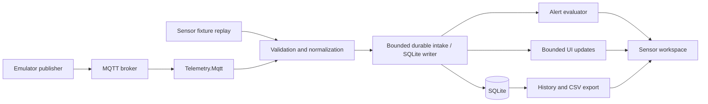

# MQTT Data Logger and Dashboard Implementation Plan

## Status and Purpose

- Created: 2026-09-11. Status: **planned; implementation has not started**.
- Repository baseline: `5969adb7e14233a6fcd9aa5bab5b3a0bd4cfe62c`.
- Goal: extend the existing Windows Forms Binance monitor with MQTT sensor monitoring, durable logging, charts, threshold alerts, history, and CSV export.
- MQTT readings will originate from an emulator installed later. Its broker connection and payload contract remain unconfirmed. Installation is outside this planning change.
- This document is the delivery tracker. Check items only after their acceptance evidence is recorded. Proposed paths, schemas, defaults, and commands below are not existing functionality.

## Reference and Current Implementation

The [reference dashboard](https://github.com/Cronware/Modbus-MQTT-Data-Logger-Dashboard/tree/d8e6f948aaf4688516b270d0da1cb43424cebcba) combines MQTT/Modbus input, pressure charts, SQLite logging, threshold alerts, history filters, and CSV export. Its legacy .NET Framework packages and pressure-specific design are inspiration for behavior, rather than a migration target.

| Capability | Current repository | Planned addition |
| --- | --- | --- |
| Live input | Binance WebSocket trades and book tickers | Configurable MQTT subscriber receiving emulator data |
| Offline input | `samples/market.jsonl` replay | Sensor fixtures and deterministic sensor replay |
| Monitor | Latest quote and bounded event grid | Device/metric selector, values, units, freshness, trend chart |
| Persistence | None | SQLite sensor readings and alert history |
| Alerts | None | Configurable low/high thresholds, hysteresis, acknowledgement |
| History/export | None | Paginated filters and streaming CSV export |
| Modbus | None | Deferred optional direct polling; unnecessary for MQTT emulator input |

The current `src/BinanceStream/` library uses .NET 10, typed market events, reconnect logic, and cancellation. `src/BinanceMonitor/MainForm.cs` owns the UI and session controls. Its display queue drops older entries under load; it must never become the persistence pipeline. `tests/BinanceStream.Tests/` is an executable console harness, not a `dotnet test` suite.

## Scope and Design Decisions

1. Preserve Binance functionality, public library APIs, offline replay, and decimal market values. Keep the current solution and project names.
2. Add a separate sensor workspace inside the existing WinForms application. Initially allow one active input session at a time; switching between Binance and MQTT requires a completed stop. History remains accessible while disconnected.
3. Keep sensor models independent of `MarketEvent`; a pressure reading is not a trade. Support multiple devices and metrics without requiring pressure-specific controls.
4. Use MQTT first. Do not install an emulator, add a broker service, introduce direct Modbus polling, or deploy infrastructure as part of this plan.
5. Develop with checked-in synthetic fixtures before the real emulator is available. Final emulator verification is the only phase dependent on that installation.
6. Keep alerts local to the application. External notifications, cloud services, remote control, authentication for multiple users, and web dashboards are outside the initial scope.

## Proposed Architecture



The emulator is a publisher. A broker is still required unless the emulator includes one; this must be confirmed during handoff.

| Proposed location | Responsibility |
| --- | --- |
| `src/Telemetry.Core/` | Sensor records, validation, source interface, replay, alert rules; `net10.0` |
| `src/Telemetry.Mqtt/` | MQTTnet adapter, connection lifecycle, topic routing, payload mapping |
| `src/Telemetry.Storage/` | Microsoft.Data.Sqlite repository, schema migrations, writer, history queries |
| `src/BinanceMonitor/Views/` | Connections, sensors, history, alerts, and settings views |
| `src/BinanceMonitor/Controllers/` | Session coordination and UI marshaling outside `MainForm` |
| `tests/Telemetry.Tests/` | Deterministic console regression checks using the existing testing style |
| `tests/Telemetry.IntegrationTests/` | Explicitly invoked tests against a supplied disposable broker |
| `samples/telemetry/` | Valid, invalid, duplicate, retained, and out-of-order synthetic payloads |
| `docs/mqtt-emulator.md` | Confirmed emulator setup and reproducible end-to-end instructions |

Expose a cancellable `ITelemetrySource` async reading stream and typed connection states. Keep MQTT types out of the core and Forms views. Use one session owner for start, stop, reconnect, and disposal; prevent duplicate handlers after reconnect.

### Dependency Compatibility Gate

Evaluate [MQTTnet](https://github.com/dotnet/MQTTnet), [Microsoft.Data.Sqlite](https://learn.microsoft.com/en-us/dotnet/standard/data/sqlite/), and [LiveCharts2 for WinForms](https://livecharts.dev/docs/winforms/2.0.4/Overview.Installation). Pin tested versions during P1; do not copy the reference's legacy package versions or assume old MQTTnet APIs exist.

Verify .NET 10, Windows x64, chart native assets, deployment output, and warnings-as-errors. LiveCharts2 documents Windows target-framework considerations; record any minimum Windows version change before adopting it. A failed chart spike blocks selecting that package, not core ingestion or storage work.

## MQTT Contract and Lifecycle

### Proposed Contract, Pending Emulator Confirmation

Suggested topic: `emulator/{deviceId}/telemetry`. Suggested single-reading payload:

```json
{
  "schemaVersion": 1,
  "deviceId": "sensor-01",
  "messageId": "sensor-01-000001",
  "timestamp": "2026-09-11T08:00:00.000Z",
  "metric": "pressure",
  "value": 1013.25,
  "unit": "hPa"
}
```

This is a proposed fixture contract, not a claim about the future emulator. Add an explicit compatibility profile for the reference's flat pressure payload, for example `{"pressure":1013.25}`. In that profile, configure device ID, metric, and unit; mark receipt-time substitution when no timestamp exists. Never interpret a missing pressure field as zero.

Normalize each reading to source ID, device ID, metric, unit, finite numeric value, event UTC time, received UTC time, optional publisher message ID, topic, retained flag, and quality flags. Use finite `double` values for sensor measurements with documented precision; preserve the existing Binance `decimal` model unchanged. Reject malformed JSON, non-finite values, oversized payloads, missing required fields, and unsupported schema versions. Surface rejection counts with bounded diagnostic samples.

### Connection Profile

- Store host, port, protocol version, TLS mode, client ID policy, topic filters, requested QoS, mapping profile, and reconnect settings.
- Proposed defaults: MQTT 3.1.1, QoS 1 where supported, explicit user-selected broker, and certificate validation enabled. No hardcoded public broker.
- Allow unencrypted localhost development only through explicit profile configuration. Keep credentials out of source control, exports, and logs; use Windows-protected secret storage.
- Show `Disconnected`, `Connecting`, `Connected`, `Reconnecting`, `Stopping`, and `Faulted` states. Subscription acknowledgement must succeed before declaring readiness.
- Use cancellable exponential backoff with jitter. Stop retries on explicit disconnect; distinguish authentication/configuration failures from transient transport failures.
- Treat retained readings as snapshots: flag them, persist subject to deduplication, and exclude them from new live alerts and freshness calculations.
- Deduplicate using stable publisher message IDs scoped to source/device/metric. Without such IDs, document possible duplicates; do not discard legitimate identical measurements by comparing values alone.

### Delivery and Backpressure

Use a bounded persistence channel with one writer. Await capacity where the client supports it; if durability cannot be maintained, stop ingestion and expose a fault instead of silently dropping log records. UI updates may coalesce or drop intermediate display points independently.

Verify MQTTnet's acknowledgement behavior in P2. Where supported and tested, acknowledge QoS 1 only after the SQLite commit. Otherwise document the crash-loss window explicitly. QoS 0, broker retention/session policy, publisher behavior, and missing IDs prevent any blanket exactly-once guarantee.

On stop, cease intake, drain accepted readings within a configured timeout, then dispose resources. Report unsaved counts if draining fails. Disk-full and database errors must remain visible; logging must not depend on whether the chart is paused or visible.

## Storage and History

Use an application-data SQLite database, separate from the checkout and build output. Provide its location in settings. Never store credentials in it.

| Table | Planned fields and constraints |
| --- | --- |
| `SchemaVersion` | Migration version and application timestamp |
| `Sources` | Stable source ID and non-secret profile metadata |
| `Readings` | ID, source/device/metric/unit, value REAL, event/received UTC milliseconds, optional message ID, topic, retained/quality flags |
| `AlertRules` | Rule ID/version, device/metric/unit selector, low/high limits, hysteresis, cooldown, enabled state |
| `AlertEvents` | Rule/version, triggering reading ID, transition, timestamp, acknowledgement metadata |

Index readings by source/device/metric/event time and stable row ID. Add a partial unique index for non-null publisher IDs within their source/device/metric scope. Store UTC; convert to local time only for display. Preserve units and prevent unrelated units sharing a series or threshold rule.

Use a single background writer, bounded transaction batches, WAL where supported, busy timeout, parameterized queries, and separate read connections. Add versioned migrations with backup/recovery instructions. Evaluate alerts from committed readings; persist an evaluation checkpoint and replay safely after restart so a crash between storage and evaluation cannot silently skip alerts or duplicate transitions.

History must provide device, metric, time, and numeric range filters, stable ordering, pagination, and cancellation. Use half-open time intervals `[start, end)` to avoid boundary duplicates. Default retention is manual: no automatic deletion until the user explicitly configures a policy. Show database size and storage failures; implement retention in bounded background batches when enabled.

CSV export covers all filtered records, not just the visible grid. Capture a row-ID cutoff for a consistent export boundary, stream rows in the background, use ISO 8601 UTC timestamps and invariant numbers, quote fields consistently, and neutralize spreadsheet formulas in textual fields. Export through a temporary file; cancellation must not leave a misleading completed file.

## Dashboard and Alerts

- **Connections:** profile selection/editing, connect/stop controls, broker and subscription status, accepted/rejected/duplicate counts, queue depth, persistence failures, last live receipt time.
- **Sensors:** device/metric selection, latest value and unit, stale indicator, bounded rolling chart, and recent-reading grid. Use a fixed UI refresh cadence, bounded series lengths, and downsampling for large windows.
- **History:** filters, paginated readings, filtered chart, export progress, and cancellation.
- **Alerts:** rule editing, current states, transition history, and acknowledgement. Avoid repeated modal dialogs while readings continue to arrive.

Rules require `low < high`, compatible units, and validated hysteresis/cooldown settings. Values strictly below/above limits enter Low/High; equality alone does not trigger. Use hysteresis for recovery and cooldown for repeated notifications. Persist one activation per excursion plus recovery; acknowledgement does not imply recovery. Stale, invalid, retained, and late historical readings must not trigger new live alarms. Define and test the allowable lateness window in the profile.

## Delivery Tracker

### Preliminary WebSocket Chart

Requested before MQTT implementation: add a bounded native WinForms price chart to the existing Binance workspace. Scope includes a symbol selector, trade and bid/ask series, automatic scaling, and the existing replay path. MQTT dependencies and P1–P6 remain pending; this chart does not complete the proposed sensor workspace or its chart-package compatibility gate.

- Implementation: `src/BinanceMonitor/MarketChart.cs`, integrated into `MainForm.cs`.
- Limits: 300 displayed samples per symbol, 100 symbols; local display timestamps and evenly spaced points; no durable logging.
- Validation (2026-09-11): all eight pre-existing offline checks passed using the existing test binary. Fresh solution build and direct UI smoke compilation stalled without diagnostics and were stopped; new-chart compilation and visual/lifecycle verification remain outstanding. Do not treat this preliminary step as fully validated until those checks pass.

Statuses: **Ready** = can start without the emulator; **Pending** = depends on earlier phases; **External** = awaits actual emulator; **Deferred** = outside initial delivery. Owner and PR/commit remain unassigned until implementation begins.

| Phase | Status | Dependencies | Exit evidence |
| --- | --- | --- | --- |
| P0 Planning | Complete | None | Reference and baseline reviewed; this plan recorded |
| P1 Foundation | Ready | P0 | Compatibility report, fixtures, core contract, baseline checks pass |
| P2 MQTT ingestion | Pending | P1 | Broker integration tests prove lifecycle and failure behavior |
| P3 Persistence | Pending | P1, P2 delivery semantics | Migrations, restart, deduplication, storage failure tests pass |
| P4 Sensor workspace | Pending | P2, P3 | Responsive bounded UI; Binance regression checks pass |
| P5 History and alerts | Pending | P3, P4 | Filters, export, transitions, and restart tests pass |
| P6 Emulator acceptance | External | P2–P5 and emulator installation | Actual contract documented; end-to-end checklist passes |
| P7 Direct Modbus | Deferred | Separate scope decision | Separate design and acceptance plan |

### P1 — Foundation and Offline Development

- [ ] P1.1 Capture baseline build, existing offline tests, and manual Binance/replay behavior.
- [ ] P1.2 Spike and pin dependencies; record Windows support, package licenses, native deployment requirements, and compatibility findings.
- [ ] P1.3 Add proposed projects to the solution and define normalized readings, source lifecycle, and profile validation.
- [ ] P1.4 Add sensor fixtures/replay and deterministic parsing, timestamp, unit, and malformed-input checks.

### P2 — MQTT Adapter

- [ ] P2.1 Implement profiles, protected secrets, topic validation, and payload adapters.
- [ ] P2.2 Implement connect/subscribe/reconnect/stop with cancellation and typed status.
- [ ] P2.3 Prove QoS/acknowledgement boundaries, retained behavior, duplicate handling, and backpressure against a disposable broker supplied for testing.
- [ ] P2.4 Test wrong credentials, unavailable broker, invalid certificate, connection interruption, duplicate start, and shutdown during reconnect.

### P3 — Durable Logging

- [ ] P3.1 Add schema, migrations, indexes, batched writer, and database path settings.
- [ ] P3.2 Implement deduplication, UTC queries, paginated history, and optional retention.
- [ ] P3.3 Test restart recovery, locked database, full/unwritable storage, queue saturation, and drain timeout.
- [ ] P3.4 Record delivery guarantees and remaining crash windows based on measured tests.

### P4 — Sensor Workspace

- [ ] P4.1 Extract session coordination from `MainForm`; add safe stop-before-switch behavior.
- [ ] P4.2 Add connection controls, metric selection, values, chart, recent grid, freshness, and diagnostics.
- [ ] P4.3 Verify bounded memory, UI-thread access, chart disposal, resizing, and closing while active.
- [ ] P4.4 Recheck all existing Binance modes and replay manually; include UI screenshots in the implementation PR.

### P5 — History, Export, and Alerts

- [ ] P5.1 Implement history filters, pagination, filtered chart, and cancellable full-result export.
- [ ] P5.2 Implement rule validation, hysteresis, cooldown, acknowledgement, and persisted transitions/checkpoint.
- [ ] P5.3 Test threshold boundaries, stale/late data, restart replay, CSV quoting/formula safety, and timestamp filters.
- [ ] P5.4 Document database backup, retention, profiles, diagnostics, and recovery procedures.

### P6 — Emulator Handoff and End-to-End Acceptance

- [ ] P6.1 Record emulator name/version, installation host, publisher/broker topology, and startup instructions after installation.
- [ ] P6.2 Capture a sanitized real payload; confirm topics, credentials/TLS, IDs, timestamps, units, rate, QoS, and retained behavior.
- [ ] P6.3 Adapt the mapping profile and add a sanitized regression fixture for the actual contract.
- [ ] P6.4 Verify emulator → broker → subscriber → database → chart/history/CSV counts and values.
- [ ] P6.5 Exercise low/high/recovery, emulator restart, broker restart, network interruption, and application restart.
- [ ] P6.6 Record performance results and known limitations; update README, AGENTS.md, and emulator instructions for implemented behavior.

## Validation and Acceptance

Existing commands remain valid from the repository root:

```powershell
dotnet build BinanceStream.slnx -c Release
dotnet run --project tests/BinanceStream.Tests -c Release
dotnet run --project src/BinanceMonitor -c Release
```

Use the local SDK path documented in README if `dotnet` is absent from PATH. The existing optional `-- --live` check requires Binance network access. Proposed future offline command, runnable only after P1 adds the project:

```powershell
dotnet run --project tests/Telemetry.Tests -c Release
```

Document the integration harness arguments in P2; it must require an explicit test broker endpoint and keep secrets out of command-line history. Offline tests must require neither an emulator nor a public service.

| Area | Acceptance requirement |
| --- | --- |
| Regression | Warning-free Release build, all existing offline checks, and manual Binance/replay lifecycle pass |
| Correctness | Valid fixture counts/values match persisted rows; invalid messages are counted without fabricated values |
| Delivery | Stable-ID redelivery is deduplicated; missing-ID and QoS limitations are documented |
| Performance | Proposed target: 100 readings/second for 30 minutes, plus 1,000/second for 10 seconds; no silent persistence loss |
| Resources | Queue/chart/grid bounds enforced; memory stabilizes after warm-up; record hardware, memory, latency, and database growth |
| Failure | Slow/full storage visibly faults or backpressures; disconnect/close terminates cleanly within configured deadlines |
| History | UTC boundaries, filters, pagination, and complete CSV results match known fixtures |
| Alerts | One activation/recovery per excursion; restart and acknowledgement preserve intended state |
| Emulator | Sanitized actual contract fixture and reproducible end-to-end results checked in |

Performance figures are initial engineering targets, not measured guarantees. Confirm them against the actual emulator rate and deployment machine during P6. Initial delivery is complete only when P1–P6 pass or a specific exception is explicitly recorded and accepted.

## Open Decisions and Risks

| Decision/risk | Interim approach | Resolution gate |
| --- | --- | --- |
| Emulator product and broker ownership unknown | Fixture replay; no assumed bundled broker | User provides installation details at P6 |
| Payload/topics/units/rate unknown | Proposed versioned contract plus flat-pressure adapter | Confirm sanitized payload at P6 |
| QoS, IDs, session expiry, and retained policy unknown | Request QoS 1; label limited guarantees | P2 tests and P6 contract |
| Windows/chart package compatibility | Isolated spike; no warning suppression | P1 dependency report |
| Database growth and retention needs | Manual retention, visible size/errors | Select operational policy before sustained use |
| Time skew and out-of-order readings | Store event and receipt times; configured lateness gate | P1 policy, P6 clock check |
| MainForm coupling and regressions | Small controller/view extraction with existing behavior checks | P4 regression evidence |
| Direct Modbus requested later | Separate adapter and scope; no current dependency | P7 only after explicit request |

## Progress and Decision Log

For each completed item, append date, task ID, owner, commit/PR, validation command or manual evidence, and remaining limitations. Update dependencies and decisions when scope changes. Do not mark emulator acceptance complete using only replay or a substitute publisher.

| Date | Item | Result / evidence | Commit or PR |
| --- | --- | --- | --- |
| 2026-09-11 | P0 | Reviewed current source and reference; defined MQTT-first delivery and deferred emulator handoff | This planning change |

## Source Notes

- Reference pinned above at `d8e6f948aaf4688516b270d0da1cb43424cebcba`; reviewed 2026-09-11.
- [Reference Form1 implementation](https://github.com/Cronware/Modbus-MQTT-Data-Logger-Dashboard/blob/d8e6f948aaf4688516b270d0da1cb43424cebcba/ModbusMQTTDataLoggerDashboard/Form1.cs) establishes the pressure payload and UI workflow. The proposed background writer and alert state machine are new design decisions.
- [Reference dependency manifest](https://github.com/Cronware/Modbus-MQTT-Data-Logger-Dashboard/blob/d8e6f948aaf4688516b270d0da1cb43424cebcba/ModbusMQTTDataLoggerDashboard/packages.config) records its legacy dependencies; candidate modern dependency documentation is linked in the compatibility gate.
